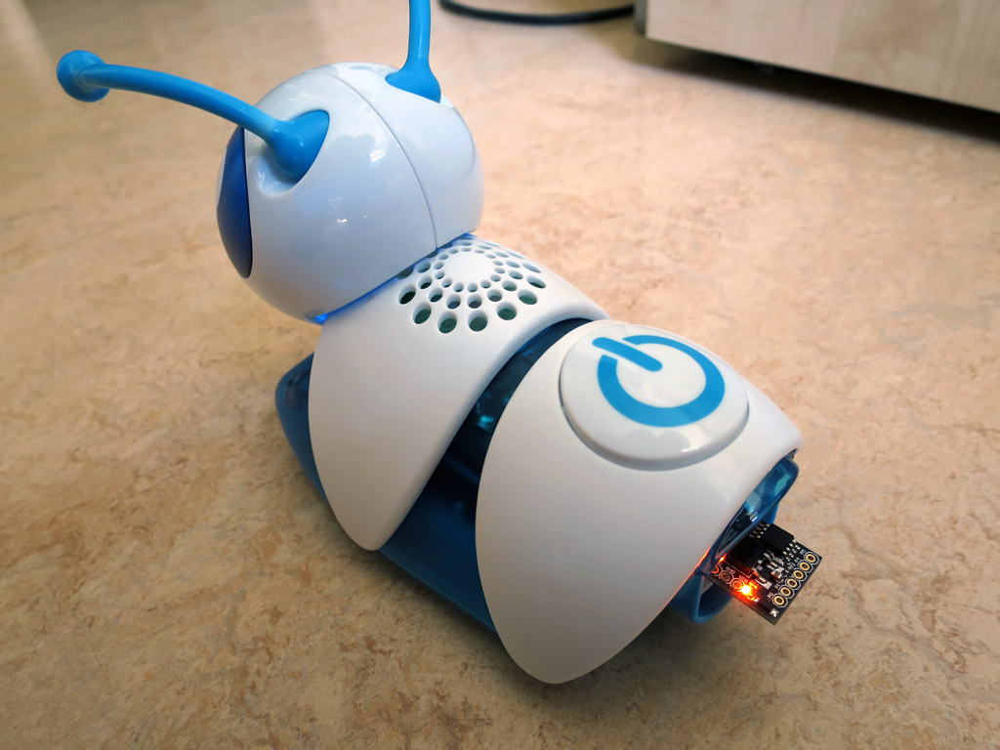

# Morph-A-Pillar - Advanced Hacking of the child's toy Code-A-Pillar

The Morph-A-Pillar code simulates Code-a-Pillar body segments.

[Code-a-Pillar](http://fisher-price.mattel.com/shop/en-us/fp/think-learn/code-a-pillar-dkt39) is a cute programmable caterpillar robot for sold for 3-6 years old kids.

### This code was inspired by [Code-A-Pillar by ffleurey](https://github.com/ffleurey/Code-A-Pillar/) and his reverse engineering efforts!

Check out his stuff, too!

## The Code

The sketch can be used to simulate a customizable number of segments, each with its unique feature.
I found out several more IDs than those you can buy as expansion pack.

There are also a few part IDs that are actually used for factory testing.

## Hardware

The code has been written for attiny85 (8 MHz clock) and uses less than 1.5 KB program code space.

I used a Digispark (clone) PCB that already comes with a USB-A connector that fits directly into the head of the 
caterpillar.
It can be adapted to different microcontrollers and pin-outs by modifying the defines at the top of the file.

Without additional hardware, the Digispark can only be used as last segment (or last N segments). 
By wiring-up a USB-A female socket and using the optional EN_OUT pin, the module can also be used in between 
body segments (although this is untested).

The LED on the Digispark is used for error reporting and also simulates the blinking behavior of the segment during use.

Debugging the module really was a PITA :-(

Enjoy and report back what you made out of it.
